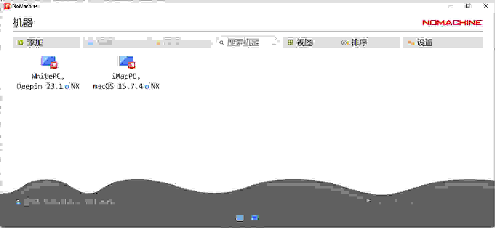
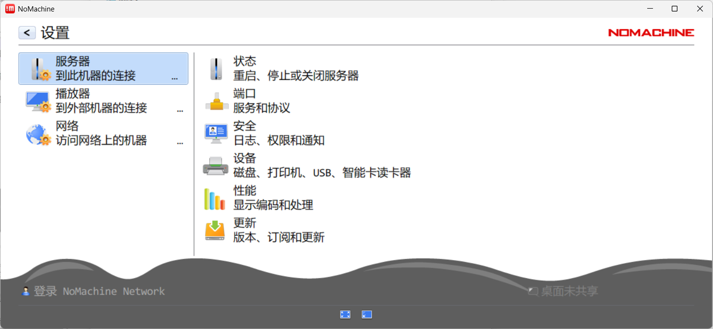
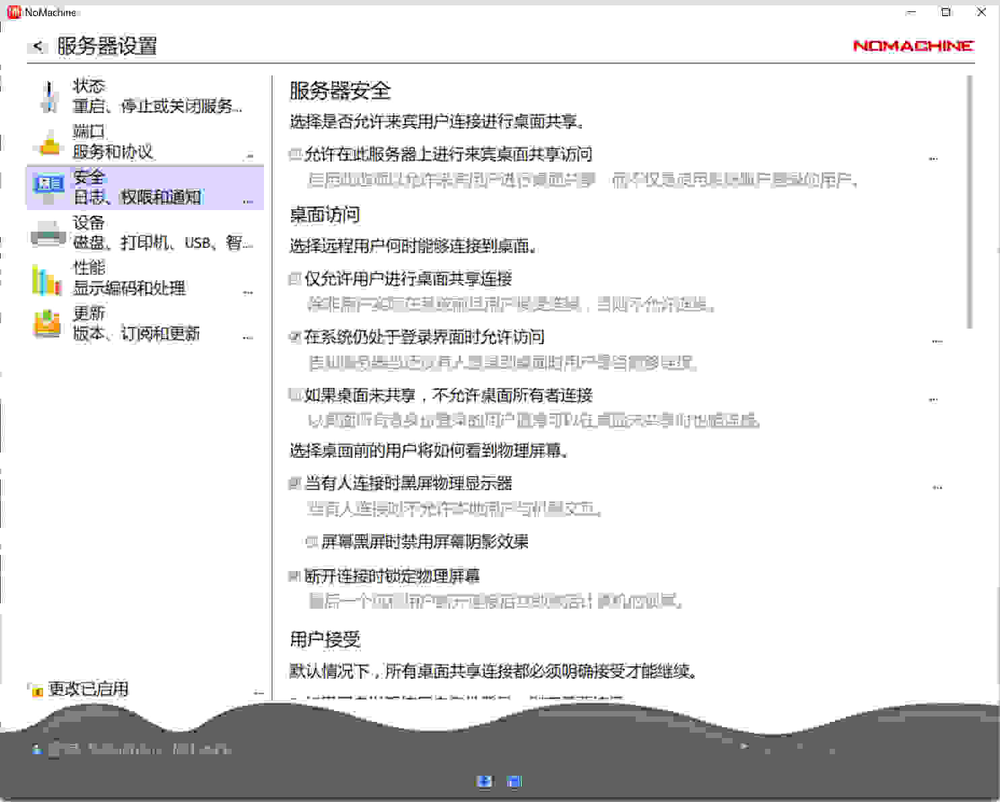

# NoMachine 中文汉化工具

将 [NoMachine](https://www.nomachine.com/) Desktop Client 界面汉化为简体中文，适配版本 **v9.5.7**。

> ⭐ 如果这个项目对你有帮助，欢迎点亮右上角的 **Star**，让更多人看到！

## 截图预览







## 原理

NoMachine 的支持语言列表硬编码在 `nxplayer.bin` 和 `nxrunner.bin` 二进制文件中。本工具将 **Portuguese（葡萄牙语）** 替换为 **Chinese（中文）**，使 NoMachine 能够加载 `zh_CN` 语言文件，从而实现界面中文化。

## 目录结构

```
nomachine_zh_CN/
├── linux/
│   ├── nx_patch_chinese.py      # Linux 补丁脚本
│   ├── nxplayer_zh_CN.qm         # nxplayer 中文翻译文件
│   └── nxrunner_zh_CN.qm         # nxrunner 中文翻译文件
├── macos/
│   ├── nx_patch_chinese.py      # macOS 补丁脚本
│   ├── nxplayer_zh_CN.qm
│   └── nxrunner_zh_CN.qm
├── windows/
│   ├── nx_patch_chinese.py      # Windows 补丁脚本
│   ├── nxplayer_zh_CN.qm
│   └── nxrunner_zh_CN.qm
├── Snapshot/
│   ├── 主页.jpg
│   ├── 配置.jpg
│   └── 配置-安全.jpg
├── .gitignore
├── LICENSE
└── README.md
```

## 使用方法

### Linux

```bash
# 查看帮助
sudo python3 nx_patch_chinese.py

# 安装中文补丁（停止服务 → 修补 → 安装翻译 → 启动服务）
sudo python3 nx_patch_chinese.py --install

# 恢复原始文件
sudo python3 nx_patch_chinese.py --restore

# 停止服务
sudo python3 nx_patch_chinese.py --stop

# 启动服务
sudo python3 nx_patch_chinese.py --start
```

### macOS

```bash
# 查看帮助
sudo python3 nx_patch_chinese.py

# 安装中文补丁
sudo python3 nx_patch_chinese.py --install

# 恢复原始文件
sudo python3 nx_patch_chinese.py --restore

# 停止服务
sudo python3 nx_patch_chinese.py --stop

# 启动服务
sudo python3 nx_patch_chinese.py --start
```

### Windows

以**管理员身份**打开命令提示符：

```cmd
# 查看帮助
python nx_patch_chinese.py

# 安装中文补丁
python nx_patch_chinese.py --install

# 恢复原始文件
python nx_patch_chinese.py --restore

# 停止服务
python nx_patch_chinese.py --stop

# 启动服务
python nx_patch_chinese.py --start
```

## 补丁做了什么

`--install` 命令会按顺序执行以下操作：

1. **停止 NoMachine 服务** — 确保文件未被占用
2. **修补二进制文件** — 将 `nxplayer.bin` 和 `nxrunner.bin` 中的硬编码字符串由葡萄牙语替换为中文，涉及：
   - 语言文件名：`nxplayer_pt_PT` → `nxplayer_zh_CN`
   - 语言名称：`Portuguese` → `Chinese`、`Português` → `中文`
   - 语言代码：`pt-PT` → `zh-CN`
   - 国旗图标：`flag-pt.png` → `flag-cn.png`
3. **安装翻译文件** — 将 `.qm` 文件复制到 NoMachine 的 locale 目录
4. **创建国旗图标** — 复制一份葡萄牙国旗作为中国国旗占位图标
5. **更新配置文件** — 将 `player.cfg` 中的语言设为 `Chinese`
6. **启动 NoMachine 服务** — 使更改生效

`--restore` 命令会从 `.bak` 备份文件恢复所有修改（首次打补丁时会自动创建备份）。

## 前提条件

- **NoMachine v9.5.7** 已安装（不保证其他版本兼容）
- Linux / macOS：需要 **root 权限**（使用 `sudo`）
- Windows：需要以**管理员身份**运行命令提示符
- macOS：由于 SIP 限制，请在宿主机终端直接执行，**不要通过 SSH 远程执行**

## 兼容性

仅适配 **NoMachine Desktop Client v9.5.7**，不保证向后或向前兼容。升级 NoMachine 后可能需要重新执行补丁。

## 许可证

[MIT License](LICENSE)
